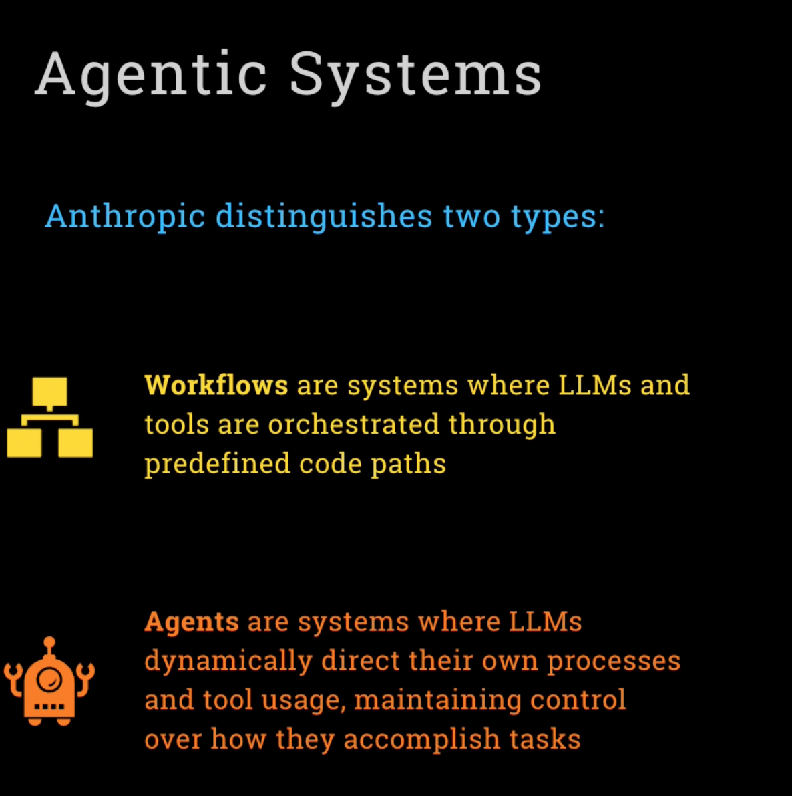
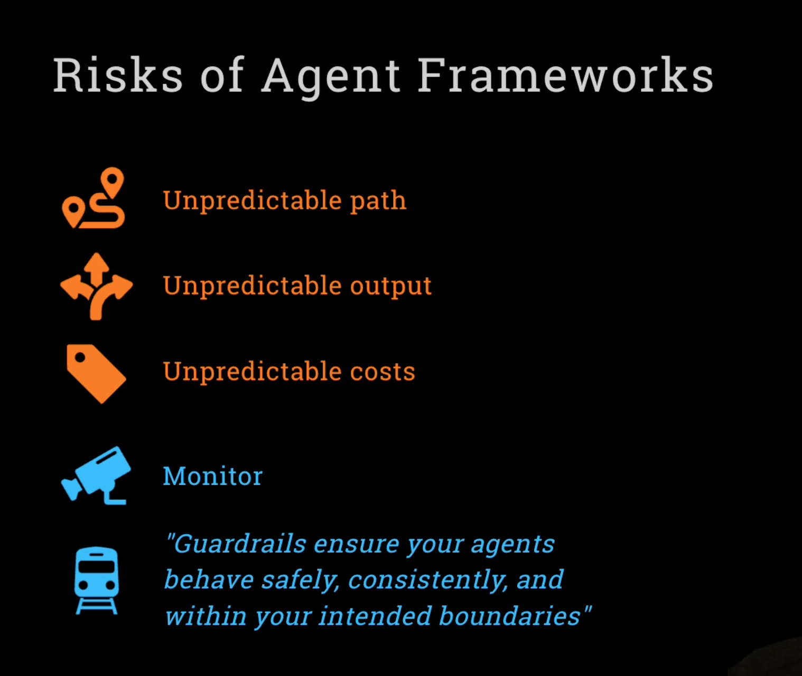
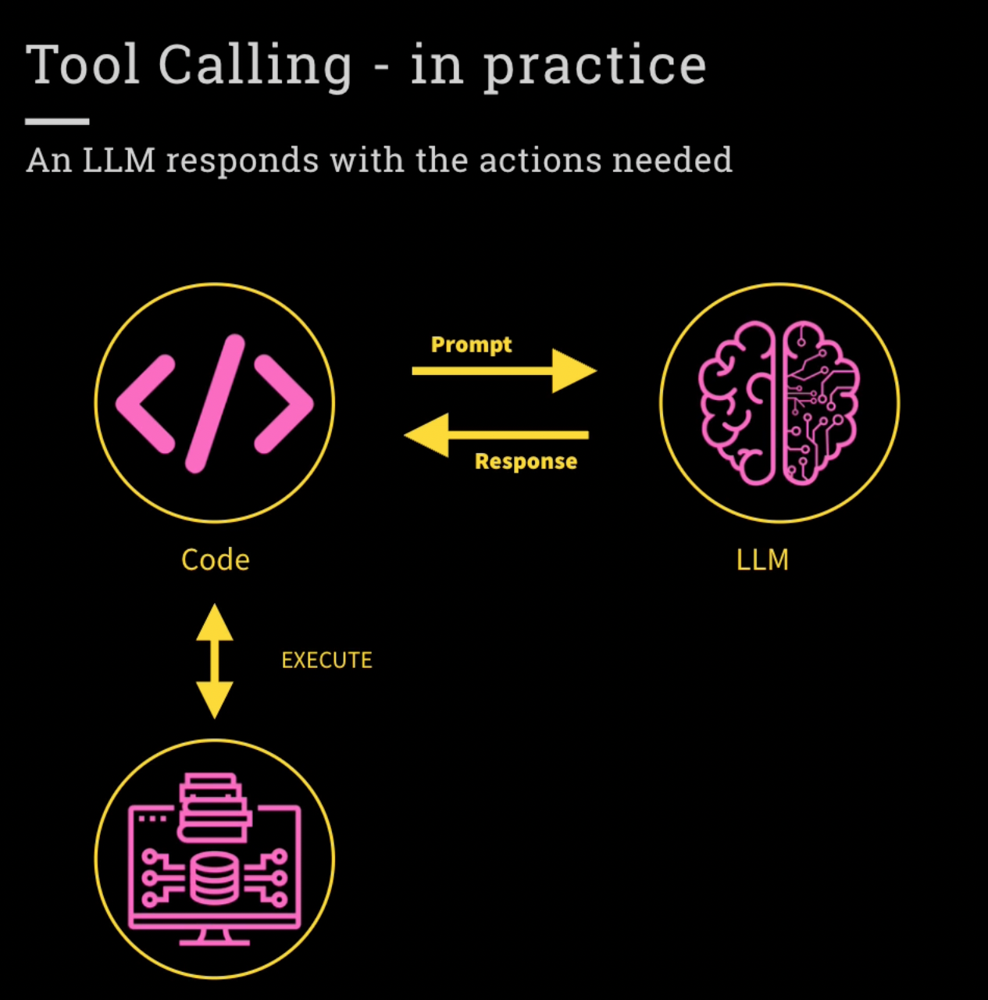

# Example Usecase 

- Build a digital AI Pipeline with agents that has capabilites to turn PDF menus into structured formats in multiple lanaguages.

Steps of above Agent: 

- PDF or Image Input 

- AI Powered Data Extraction : Scan each image page, recognize item names , descriptions and prices. 

- Formatting into excel: Push the extracted data into excel sheet which follows a very specific format.

- Instant Translation 

- Upload & Sync 

## Agent

- In a nutshell it's a AI system that uses LLM as a brain to analyze problems and select external tools. 

- An Agent can be program where LLM outputs control the workflow. (Source: Anthropic)

What characteritics determine Agent 

1) Multiple LLM calls. 

2) LLMS interaction to use or pick Tools to solve a task. 

3) LLM orchestration in an environment to exchange messages. 

4) A planner to coordinate activities. 

5) Autonomy 

## Three Steps for Agent

1. Create an instance of Agent

2. Use with trace() to track the agent 

3. Call runner.run() to run the agent