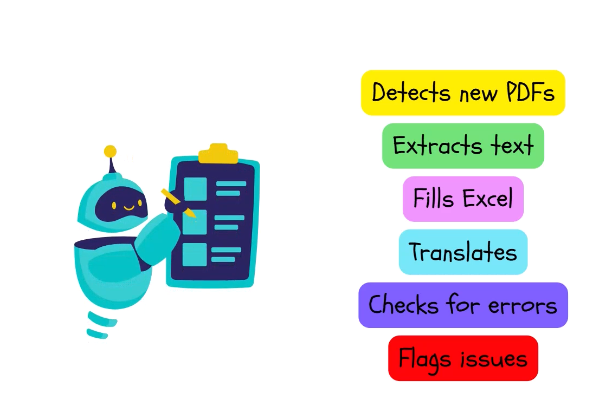

# Example Usecase 

- Build a digital AI Pipeline with agents that has capabilites to turn PDF menus into structured formats in multiple lanaguages.

Steps of above Agent: 

- PDF or Image Input 

- AI Powered Data Extraction : Scan each image page, recognize item names , descriptions and prices. 

- Formatting into excel: Push the extracted data into excel sheet which follows a very specific format.

- Instant Translation 

- Upload & Sync 

## Agent

In a nutshell it's a AI system that uses LLM as a brain to analyze problems and select external tools. 