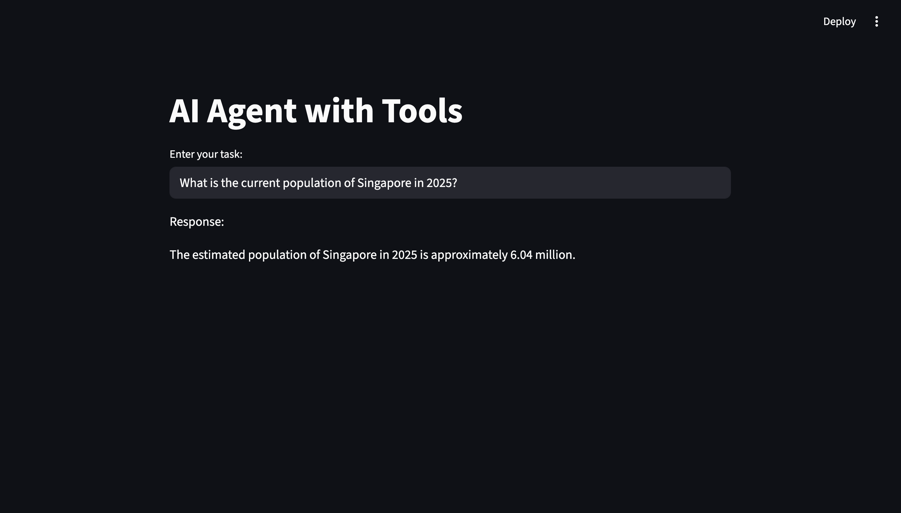
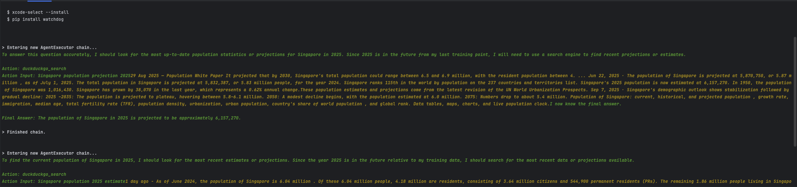

What is Agent? 

- In simple terms agents are nothing but a system more like a AI assistant that takes a task and it uses LLM as a reasoning engine to think & decide what actions to take and execute those actions.The agent doesn't just follow instructions blindly—it reasons, chooses the best tools, and adapts until it gets a good result.

Summary: 

 - Pick the tool by using LLM reasoning to accomplish the task. 
 - From the selected tool then take action , get the response & observe the response.
 - Once the above response is good enough then send it to the user, if not repeat the above steps of reasoning.

# Benefits of Agents

- Automation: Agents handle repetitive or complex tasks for you.

- Reasoning: They use LLMs to make smart decisions, not just follow rules.

- Tool Integration: Agents can use external tools to fetch data, search the web, or interact with APIs.

- Scalability: You can deploy agents for many tasks, freeing up your time for creative work.


# What is a Tool? 

Tools are special functions or service that an LLM can call when its intent matches a specific action.

- It may be internal or external functions, often from a library, and are used to perform actions based on the input provided. 

- By leveraging tools, the agent can extend its capabilities beyond reasoning and interact with external systems or perform complex operations as needed.

```
import os
from langchain_openai import ChatOpenAI
from langchain import hub
import streamlit as st
from langchain.agents import create_react_agent, AgentExecutor
from langchain_community.agent_toolkits.load_tools import load_tools


OPENAI_API_KEY = os.getenv("OPENAI_API_KEY")
llm=ChatOpenAI(model="gpt-4o", api_key=OPENAI_API_KEY)


# Pull these below prompt from the hub.
prompt = hub.pull("hwchase17/react")

tools = load_tools(["wikipedia", "ddg-search"], llm=llm)    
```

# How to Run This App
- Make sure you have your OPENAI_API_KEY set in your environment.
- Install the required Python packages (see requirements.txt).
- Run the app using Streamlit

```
    streamlit run agent_demo.py
```

# Input & Output of Agent





Limitations of Agents
- Dependence on LLM Quality: The agent is only as smart as the LLM it uses.
- Tool Coverage: If a needed tool isn’t available, the agent can’t perform that action.
- Cost & Latency: LLMs can be expensive and sometimes slow, especially for complex tasks.
- Reasoning Boundaries: Agents may not always reason perfectly or understand ambiguous instructions.