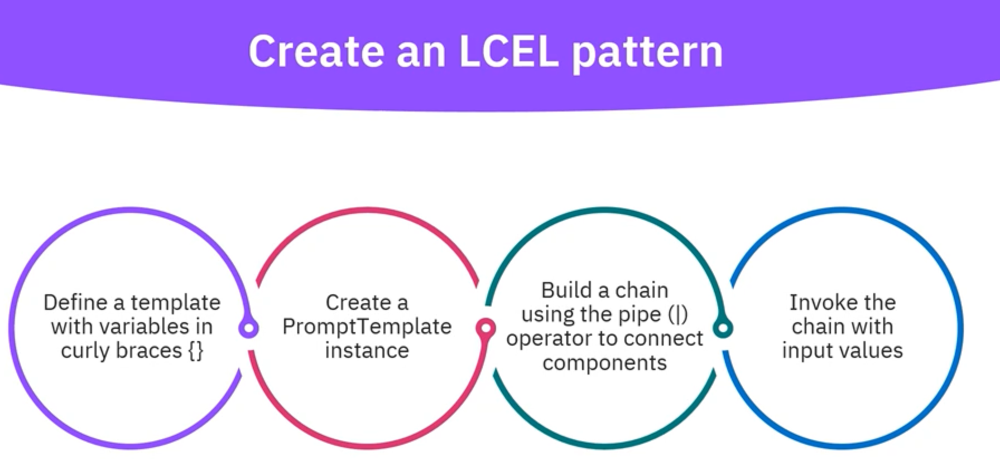
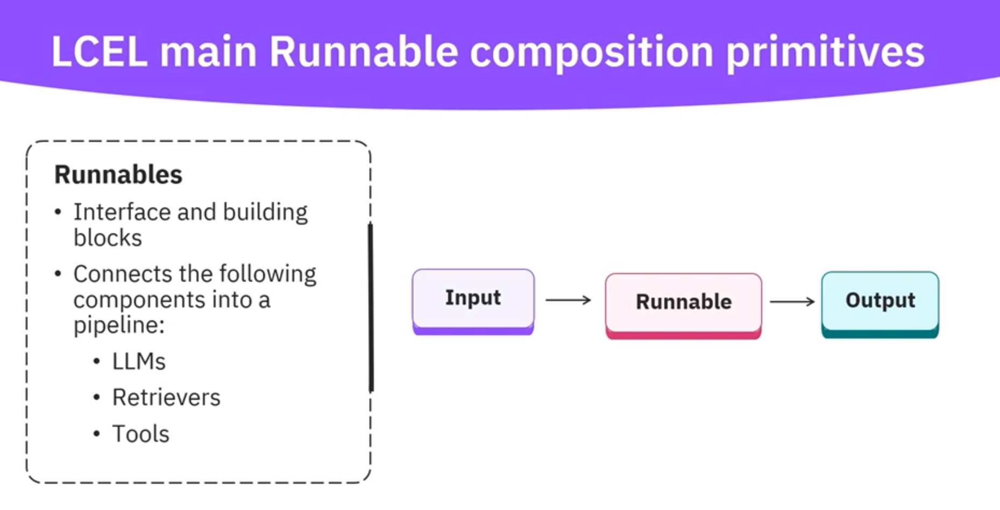
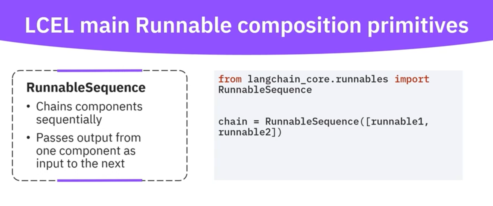
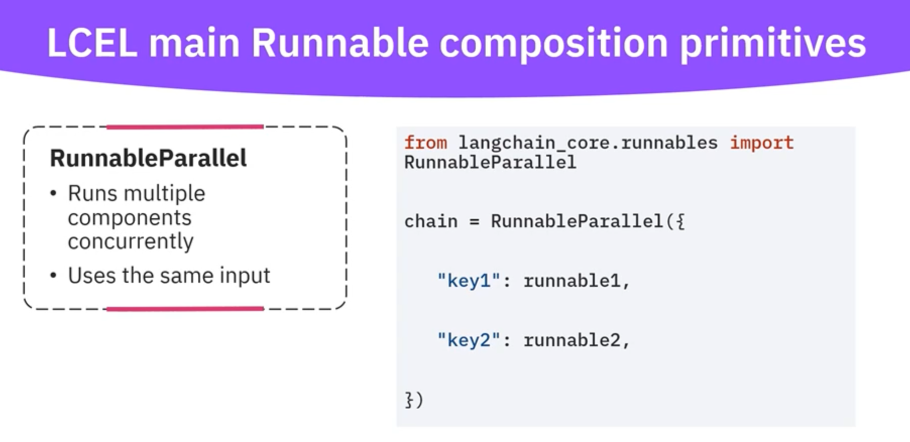
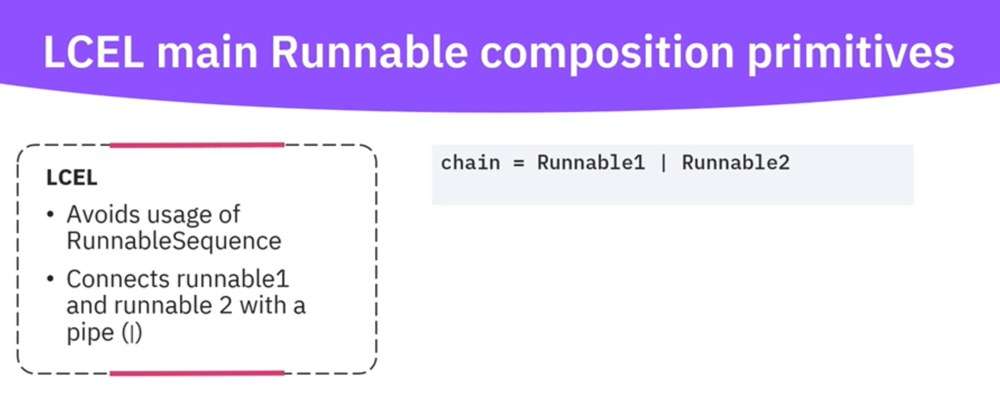
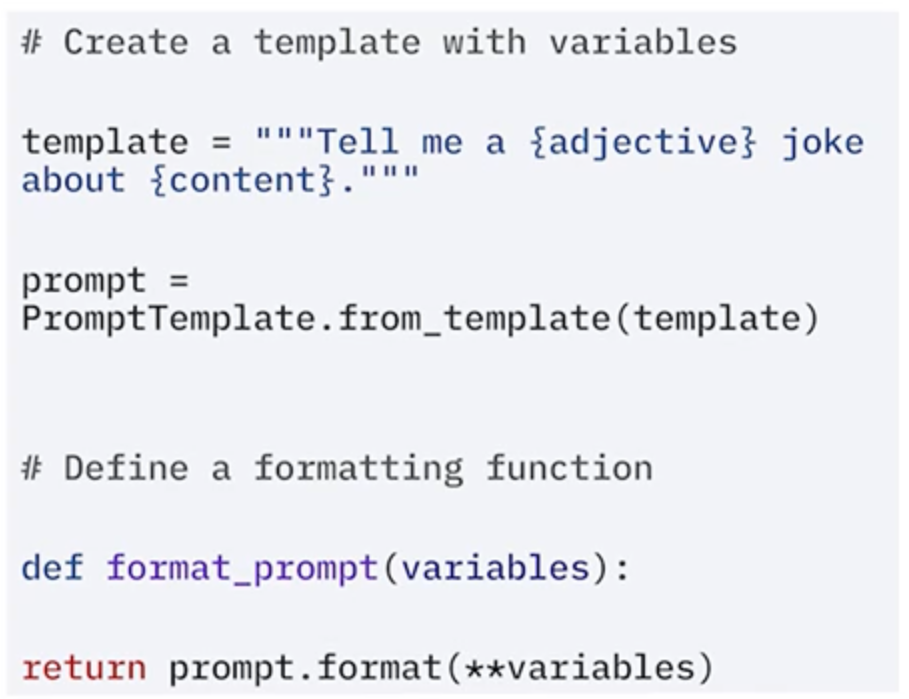
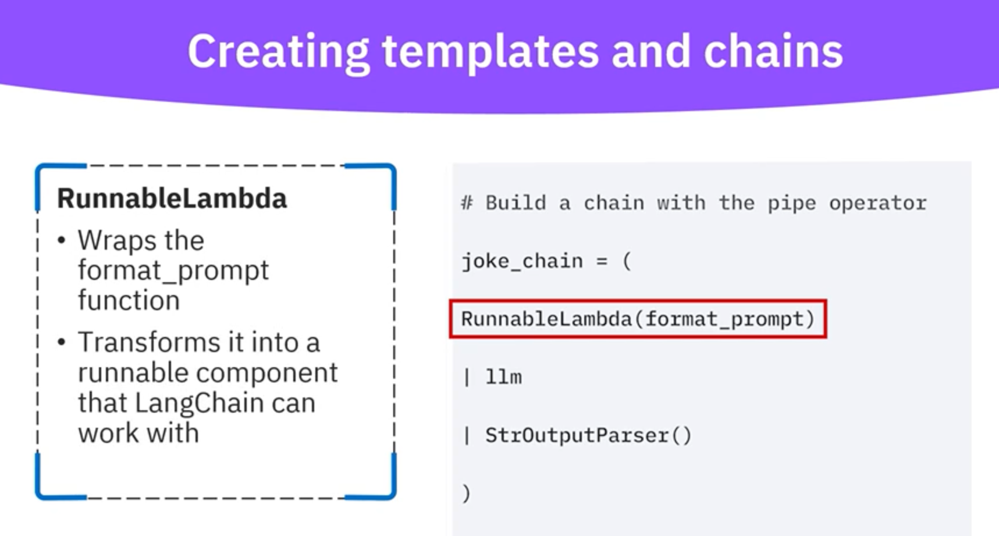
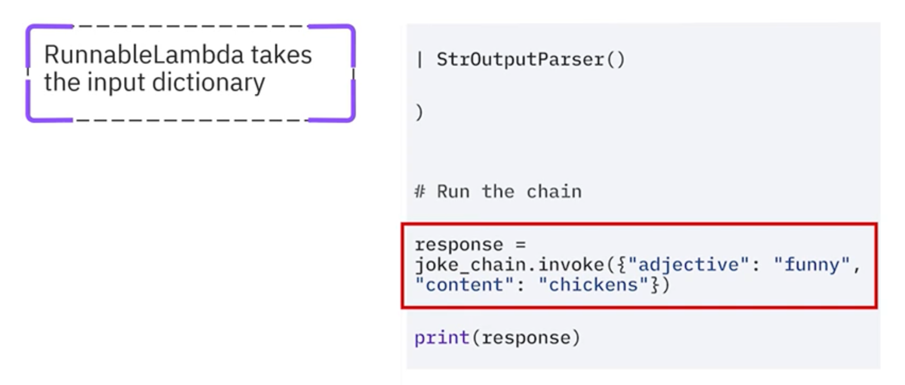
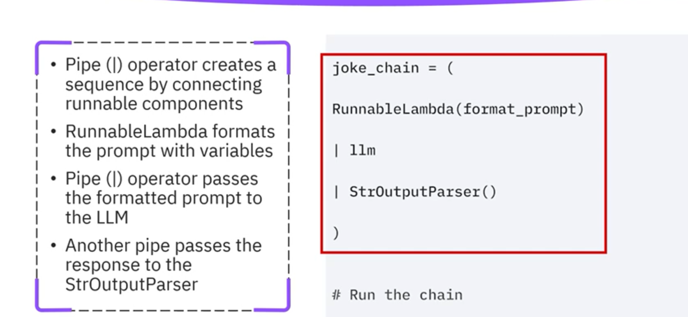
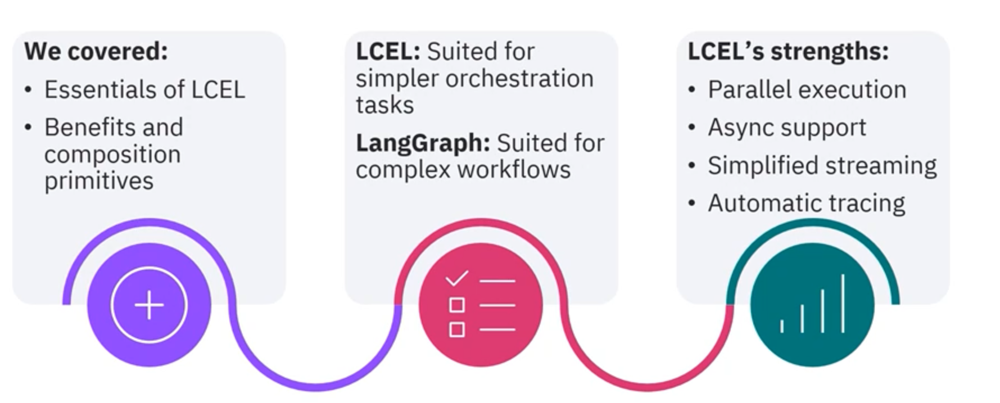

# LCEL 

- Langchain express language gives you the ability to connect components using (|) operator.

- Ensures a clean , readable flow of data.

LCEL Provides 

- Better flexibility when constructing complexa chains. 
- Gives clear visibility of data flow.
- Better composability.

How to build LCEL 

Runnables 

Runnable Sequence

Runnable Parallel

Runnable Pipe 

# Template & Chains

