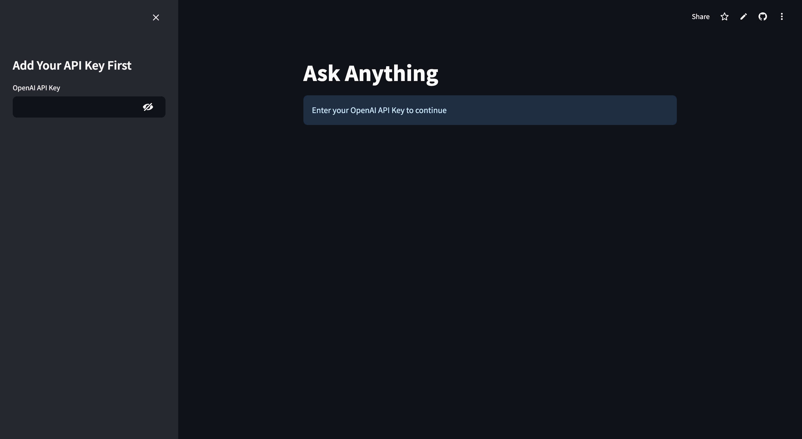
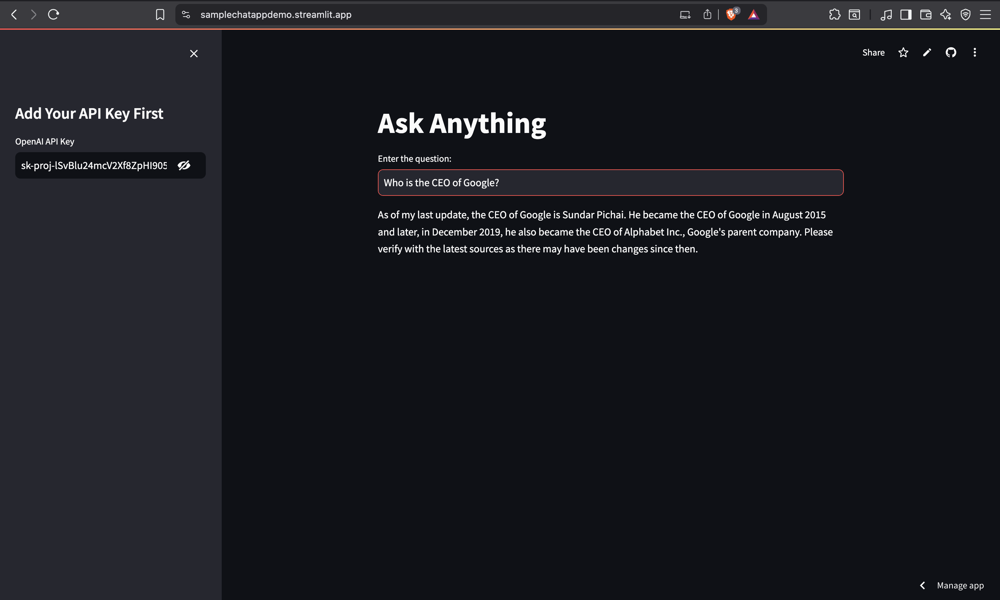

# Streamlit 

- Open Source Library to quickly develop web apps which can be shared with minimal effort with intutive built in widgets. 

# Why do we need Streamlit?

Rapid prototyping: Build and visualize data apps without front-end experience.
Interactivity: Add sliders, buttons, and other widgets for user input.
Sharing: Easily share apps with colleagues or stakeholders.

How to deploy a Streamlit app on the cloud:

- Prepare your app: Ensure your main app file (e.g., streamlit_demo_app.py) and requirements.txt are ready.
- Choose a cloud platform: Streamlit Community Cloud (free, easy for public apps)

- For Streamlit Community Cloud:
Push your code to GitHub.
Go to https://streamlit.io/cloud and sign in.
Click "New app", select your repo and main file, then deploy.


Successful Deployed Streamlit App:  [DeployedApp](https://samplechatappdemo.streamlit.app/)

# How to run this app

```
streamlit run streamlit_demo_app.py
```


