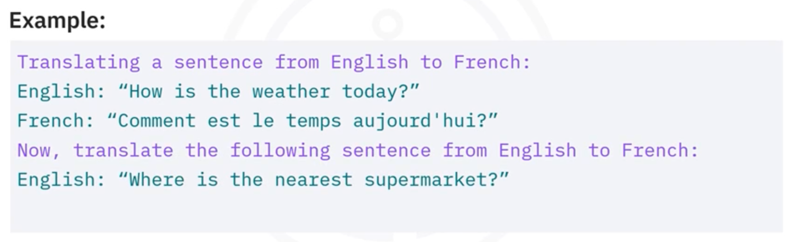
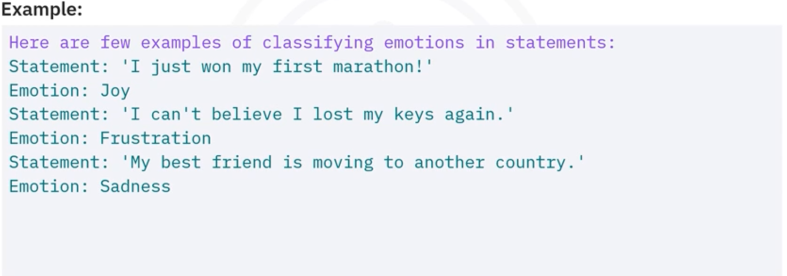
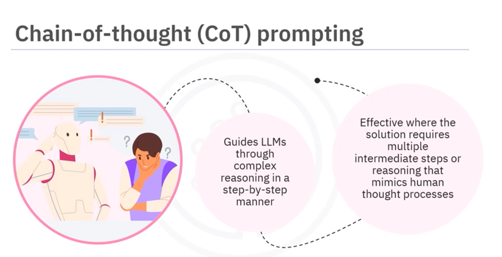
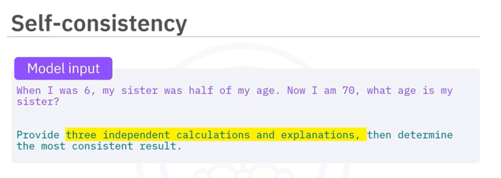
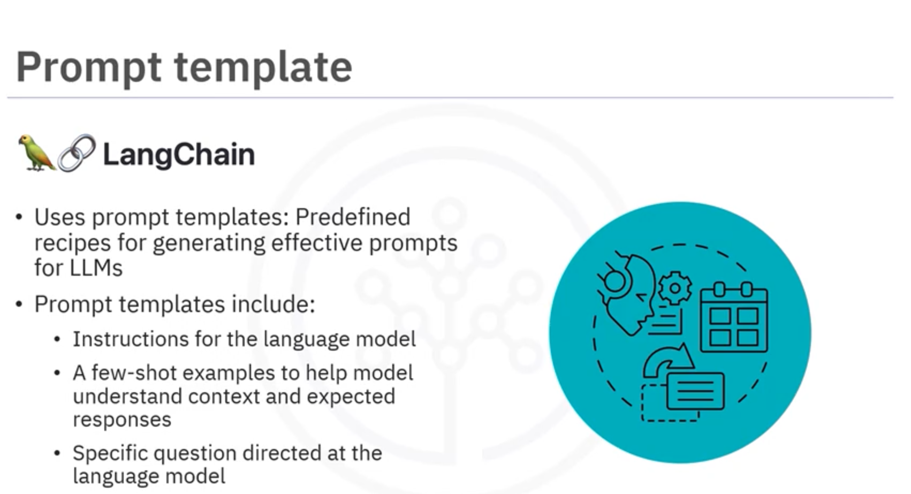

Zero Shot 

- Asking/Instructing an LLM to perform a task without any specific training or examples. 

```
Example: Classify the statement as true or false.

The Eiffel tower is located in Paris.

```

One Shot 

- Instructing an LLM to perform a task by giving a single example.

Example: 



Few-shot prompt 

- Learns from small set of examples before instructing the LLM to perform a given task. 



COT Prompt







```
from langchain_core.prompts import PromptTemplate

prompt_template = PromptTemplate.from_template("Tell me {adjective} joke about {content}")

prompt_template.format(adjective="funny", content="sport")

```