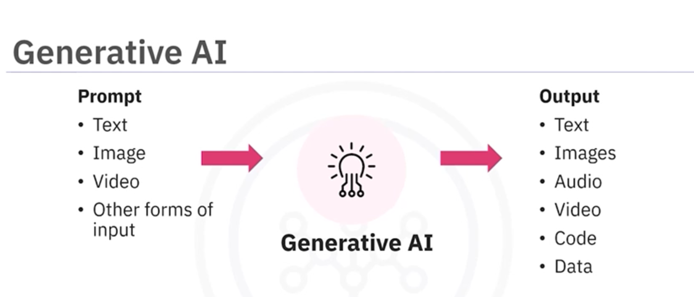
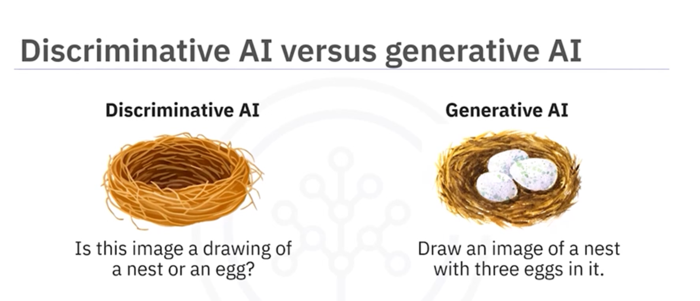
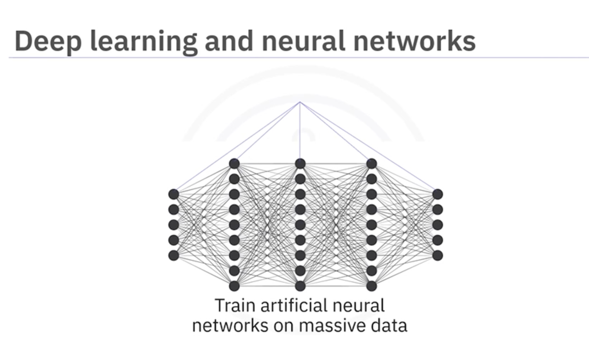
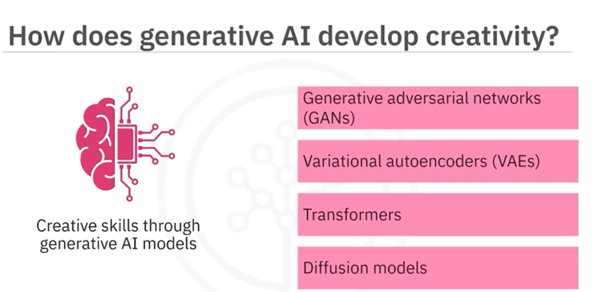
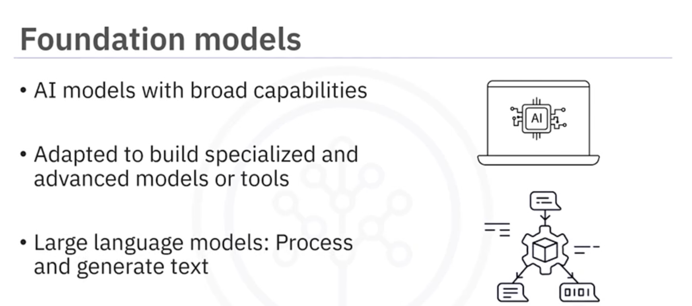
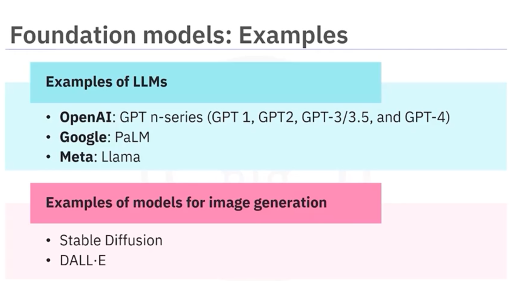
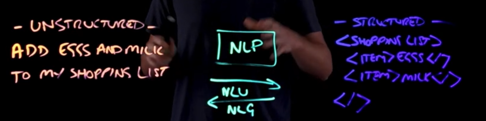
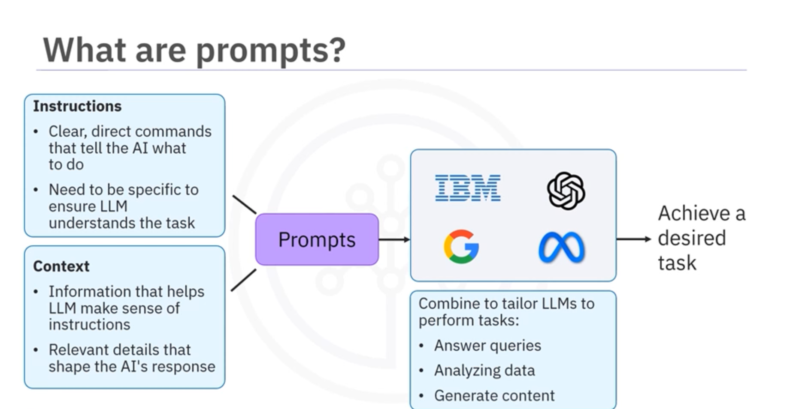
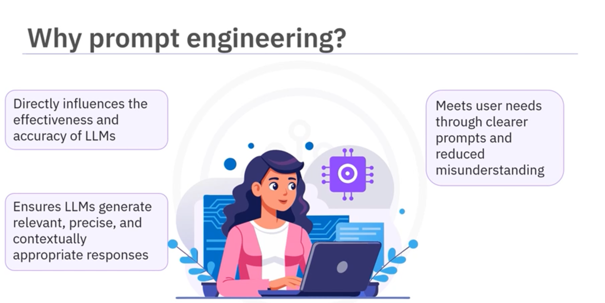
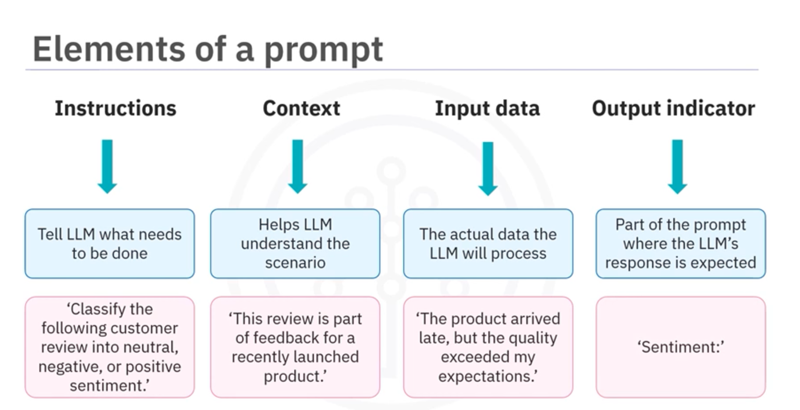

# Step 1: Pre-requisites 

- Python 
- Install Conda 

## Step 2: Check your conda env If conda does exist install it. 

- conda env list
- conda create -n genai python=3.10 -y
- conda activate genai


# Step 3 Install libraries

```
pip install -r requirements.txt
```

# Let's understand the libraries 

nltk: To deal with processing of text for tokenization

Tokenization: Splitting the text into words, sentences,etc. 

Typical use cases:

- Text preprocessing for machine learning
- Sentiment analysis
- Information extraction
- Building chatbots
- Language modeling

Example: 

```
import nltk
nltk.download('punkt')
from nltk.tokenize import word_tokenize

text = "Hello, how are you?"
tokens = word_tokenize(text)
print(tokens)  # Output: ['Hello', ',', 'how', 'are', 'you', '?']
```

TfidVectorizer: To transform text into vectors that can be used as input for machine learning algorithms.

```
import skilearn.feature_extraction.text import TfidfVectorizer
 
```

# To calculate the cosine similarity between two vectors. 

```
from sklearn.metrics.pairwise import cosine_similarity
```

AI MODELS

* Process of Learning from data is called training. 

Two fundamentals approach to AI

 - Discriminative AI
 - Generative AI 

 Discriminative AI 
  
  - Ability to classify the data from the data which has labelled data. 

  Example: Email Spam Filters 

Limitations

- Can't generate new content. 
- Can't understand context.

Gen AI

- Ability to generate the new content based on training data. 



## Example of Discriminative AI vs Gen AI



## Deep Learning



## How Gen AI develops creativity 



## Foundation models



## Foundation models Examples 




# NLP 

Unstructured -> English sentence to do a task. 

Example: Add eggs and milk to shopping list. 

NLU -> Convert the above into xml or json (Natural Language Understanding)

<shoppinglist>
<item>Egggs</item>
<item>milk</item>
</shoppinglist>

NLG -> Covert the above to Unstructured such as (Natural Langugage Generation)

Add eggs and milk to shopping list. 



The input to NLP is unstructured text which is written or spoken text through a speech-to-text algorithm.

The First after NLP is Tokenization which means taking a string & breaking down into chunks. 


# Prompts 

Input to model in the form of text, image, audio, video to do a specific task.



Why Prompt Engineering? 


# Elements of Prompt 

