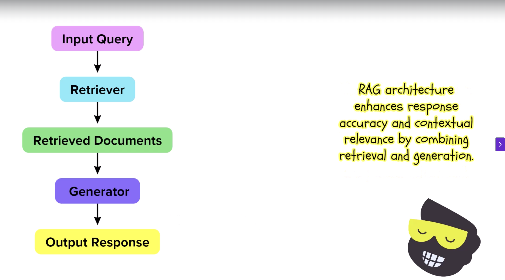

# Vectors 

Process of converting queries or documents (which are text based) into mathematical numbers to do a similary search

# Similarity

The relevance of the document is determined by the similarity between their vectors often measured by consine similarity.

# How it Works

The documents are converted into vectors and query is converted into vectors then similarity search is applied to find relevant document.

# RAG Architecture

## Input Query

The input query is the user questions. 

## Retriever 

It uses similarity search or vector based search to find the relevant documents. 

##  Retrieved Documents 

These are the documents identified after the search is done. 

## Generator 

It takes the input query & retreived documents to generate most relevant information.

## Output 

This is the final response after all the steps are done in RAG.

#LLM 

Large Language Model is a model that has been trained huge data set which has the capabilites understanding patterns, context and structure to predict the next word in the sequence. 

# Transformers 

[Transformers](https://aws.amazon.com/what-is/transformers-in-artificial-intelligence/)